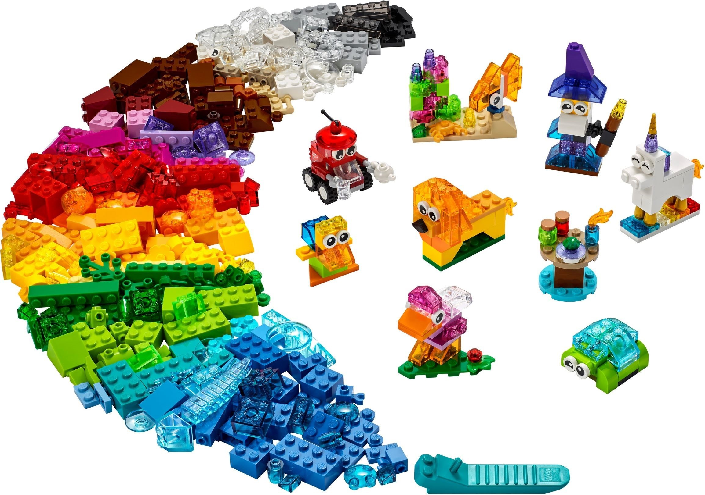

# realbizgames-unity-common-init-chain



# The Concept
1. Games contains many the same resuable components.
2. Build these "the same resuable components" into many simple, statble, scalable smaller projects.
3. Combine them to make a big game project.


Let's start from NOW or NEVER.
  
## iOS 14 ATT

https://github.com/Unity-Technologies/com.unity.ads.ios-support

```
"com.unity.ads.ios-support": "1.0.0",
```

## Unity Purchasing

```
"com.unity.purchasing": "3.2.1",
```

## RealbizGames Data
https://github.com/truonguit2010/realbizgames-data/tree/main
```
"com.realbizgames.data": "https://github.com/truonguit2010/realbizgames-data.git#v1.0.0",
```

## Banner Ad Settings

```
https://github.com/truonguit2010/realbizgames-banner-ads-setting
```

# 3rd Party Components
#### 1. Facebook SDK
- https://developers.facebook.com/docs/unity/
